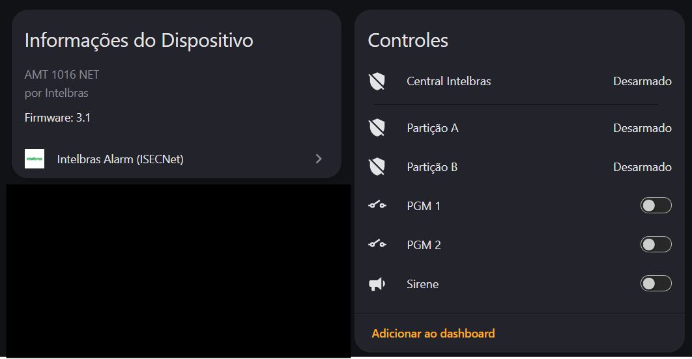
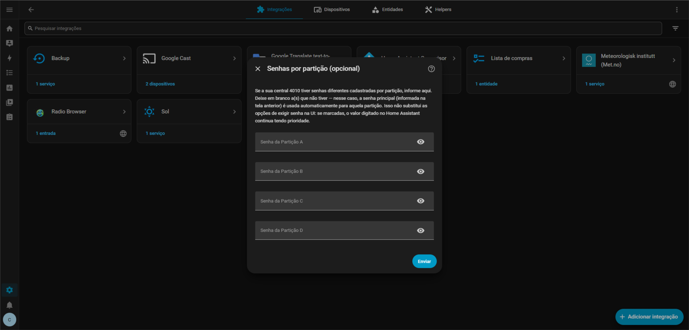
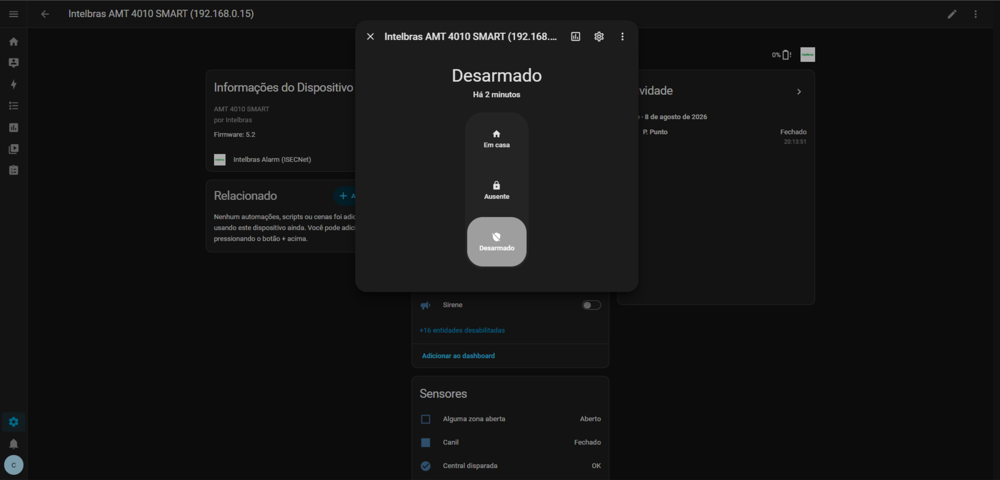
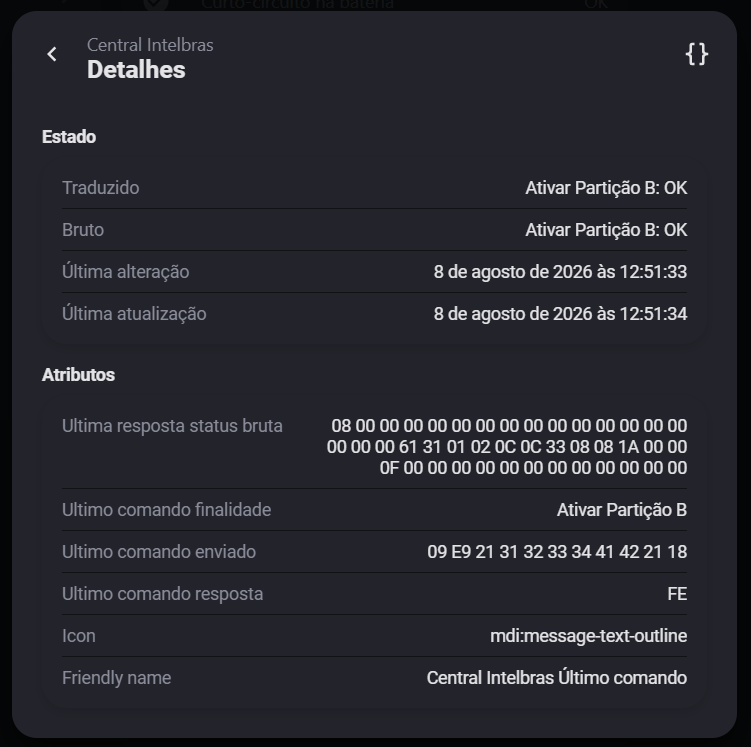
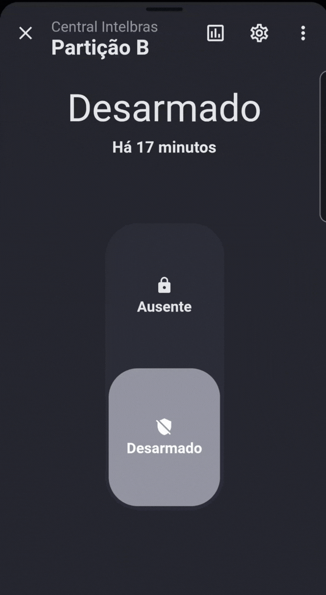
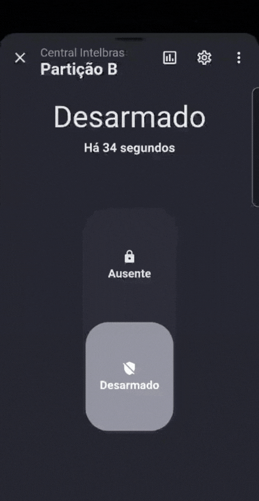
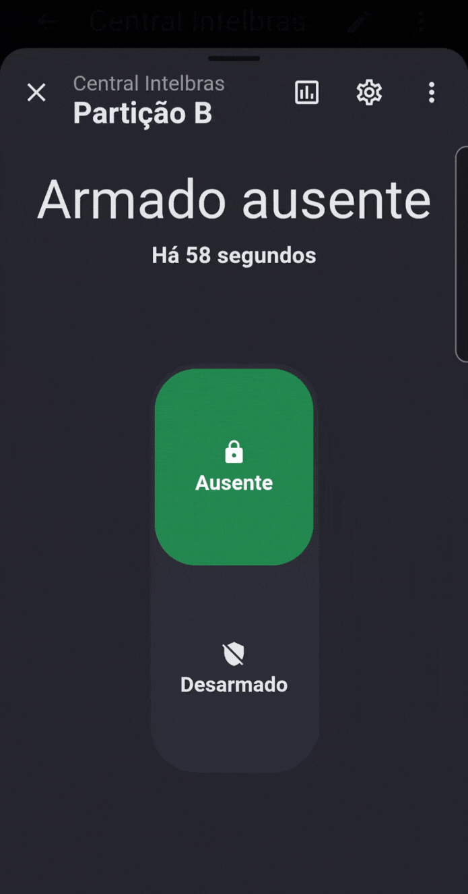

# Intelbras Alarm (ISECNet) — Home Assistant

Integração HACS para centrais de alarme Intelbras **AMT 1016 NET, AMT 2018
E/EG, AMT 2018 E SMART, AMN 24 NET e AMT 4010 SMART**, via protocolo
ISECNet/ISECMobile (o mesmo do app AMT Mobile) — conexão TCP direta e
persistente com a central.

A integração usa as entidades **padrão do próprio Home Assistant** para
representar a central como uma central de segurança de verdade deveria
ser representada: `alarm_control_panel` para a central e cada partição,
com os estados de um alarme real (desarmada, armada ausente, armada
presente, disparada), suporte a senha para armar/desarmar (opcional), e
todos os diagnósticos da central (bateria, rede elétrica, tamper,
sabotagem, sirene, etc.) como entidades próprias.

> 📘 Documentação técnica completa (mapeamento de bits do protocolo,
> decisões de design, histórico de correções): [README_DETALHADO.md](README_DETALHADO.md).
> Este README é o resumo prático para instalar e usar.



---

## Instalação

**Via HACS**: HACS → Integrações → menu (⋮) → Repositórios customizados →
adicione a URL deste repositório (categoria Integração) → instale
"Intelbras Alarm (ISECNet)" → reinicie o Home Assistant.

**Manual**: copie `custom_components/intelbras_alarm` para
`<config>/custom_components/` → reinicie o Home Assistant.

## Configuração

**Ajustes → Dispositivos e Serviços → Adicionar Integração → Intelbras Alarm**


1. **IP** e **porta** da central (padrão `9009`).
2. **Senha** ISECMobile (a mesma do app AMT Mobile, 4 a 6 dígitos).
3. Opcional: marque se quer que o Home Assistant **peça a senha** antes de
   ativar e/ou desativar pela interface (por padrão, nenhuma das duas —
   usa a senha configurada automaticamente, sem perguntar nada).
4. Opcional: **zonas habilitadas por padrão** — formato `1-5;8;10-15`
   (intervalos e/ou números separados por `;`). Padrão: `1-8;17-24`. As
   demais zonas continuam existindo, só ficam desabilitadas até você
   habilitá-las manualmente em Configurações → Entidades.
5. O **modelo é detectado automaticamente** — sem campo manual.
6. Só para a **AMT 4010 SMART**: uma tela extra permite cadastrar senhas
   diferentes por partição (A/B/C/D), se sua central tiver — opcional,
   deixe em branco para usar a senha principal em todas.

   

Depois de configurada, em **Configurar** na própria integração (Ajustes →
Dispositivos e Serviços → Intelbras Alarm → Configurar) dá pra ajustar,
**sem remover e reconfigurar do zero**: a senha principal (validada contra
a central antes de salvar), as senhas por partição (4010), as opções de
exigir senha e o intervalo de polling. IP, porta, modelo e zonas
habilitadas por padrão não são editáveis ali (esse último só funciona na
configuração inicial) — para isso, remova e reconfigure.

---

## Entidades criadas

- **Alarme** (`alarm_control_panel`): uma para a central e uma para cada
  partição (se a central estiver particionada). Estados: desarmada,
  armada ausente, armada presente (Stay — só em AMT 4010 SMART e AMT 2018
  E SMART) e disparada — os mesmos estados que uma central de alarme de
  verdade tem, com suporte a código/senha na própria interface.

  

- **Zonas** (`binary_sensor`, uma por zona): aberta/fechada, com violação,
  anulação, bateria baixa, tamper e curto-circuito como atributos (quando
  aplicável àquela zona).
- **Diagnóstico da central** (`binary_sensor`): rede elétrica, bateria
  (fraca/ausente/curto), sobrecarga, sirene (fio cortado/curto), linha
  telefônica, falha de comunicação, particionamento, disparo, zona aberta
  agregada, problema em teclados/receptores (desabilitados por padrão —
  habilite manualmente os que existem na sua instalação) e (só na 4010)
  expansores de PGM/zona.
- **Bateria e contadores** (`sensor`): nível de bateria (%), contagem de
  zonas abertas/violadas/anuladas/com bateria baixa (sensores sem fio, com
  a lista de quais zonas nos atributos), e **"Último comando"** (rastreia
  a última ação enviada e a resposta da central, separado da consulta de
  status normal).
- **PGMs e sirene** (`switch`): controla e mostra o estado real de cada
  PGM e da sirene.
- **Conexão com a central** (`switch`): liga/desliga a comunicação TCP —
  útil para manutenção, sem precisar remover a integração.
- **Botões** (`button`): pânico (silencioso/audível/médico/incêndio),
  anular zonas abertas/violadas/ambas, remover todas as anulações, e
  (só na 4010) sincronizar nomes de zona lidos da central.

## Serviço `intelbras_alarm.bypass_zone`

Anula ou reativa uma ou mais zonas por número, direto de automações,
scripts ou pela aba Ferramentas de desenvolvedor → Ações:

```yaml
service: intelbras_alarm.bypass_zone
target:
  entity_id: alarm_control_panel.central
data:
  zones: "1-5;8;10-15"   # intervalos e/ou números separados por ;
  bypass: true             # true = anular, false = reativar
```

Sempre usa a senha configurada da central (não depende das opções de
"pedir senha" da UI). Preserva anulações já existentes em outras zonas.

## Dicas de uso

- Quer confirmar o que a integração está fazendo? O sensor **"Último
  comando"** mostra a ação enviada e a resposta da central em atributos
  separados da consulta de status normal (que atualiza rápido demais para
  acompanhar):

  

- Se algo parecer errado, olhe os atributos de `alarm_control_panel` e do
  binary_sensor "Central disparada" — mostram os bytes brutos recebidos
  da central, sem precisar mexer em log.
- Precisa de mais detalhe (log de depuração, explicação de cada bit do
  protocolo)? Veja o [README_DETALHADO.md](README_DETALHADO.md).

## Demonstração

<table>
<tr>
<td align="center" width="33%">

**Ativar/desativar sem exigir senha**
<br>(padrão — um toque, sem digitar nada)



</td>
<td align="center" width="33%">

**Ativar/desativar exigindo senha**
<br>(opção marcada na configuração)



</td>
<td align="center" width="33%">

**Disparo**
<br>(estado `triggered` refletido em tempo real)



</td>
</tr>
</table>

## Créditos

Esta integração foi construída a partir de um trabalho de engenharia
reversa do protocolo ISECNet/ISECMobile muito bem feito por
**@walberjunior**, originalmente publicado como um fluxo do Node-RED, e
complementada com o documento oficial Intelbras *"Descrição de Comandos de
Protocolo ISECnet Centrais de Alarmes – Intelbras Receptor IP"* (revisão
15) e captura de tráfego real, validado em campo com centrais AMT 1016
NET e AMT 4010 SMART.
