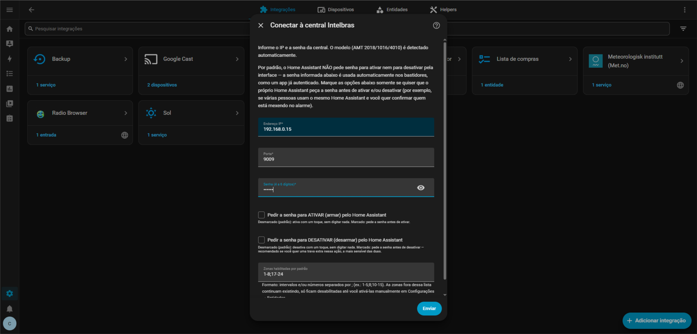

# Intelbras Alarm (ISECNet) — Home Assistant

Integração nativa (custom component / HACS) para centrais de alarme Intelbras
**AMT 1016 NET, AMT 2018 E/EG, AMT 2018 E SMART, AMN 24 NET e AMT 4010 SMART**,
via protocolo **ISECNet/ISECMobile** (o mesmo usado pelo app AMT Mobile) —
conexão TCP persistente direta com a central, dentro do próprio ciclo de
vida do Home Assistant.

A integração usa as entidades **padrão do próprio Home Assistant** para
representar uma central de alarme como ela deveria ser representada:
`alarm_control_panel` para a central e cada partição, com os estados de
uma central de segurança de verdade (`disarmed`, `armed_away`,
`armed_home`, `triggered`), suporte a senha/código para armar e desarmar
(opcional, configurável por ação), zonas como `binary_sensor`, saídas
programáveis (PGM) e sirene como `switch`, e diagnósticos completos da
central (rede elétrica, bateria, tamper, sabotagem, expansoras, etc.) como
entidades próprias — nada de sensores genéricos tentando imitar um painel
de alarme por fora.

> Baseado no documento oficial *"Descrição de Comandos de Protocolo ISECnet
> Centrais de Alarmes – Intelbras Receptor IP"* (AMT2018 E/EG e AMT4010
> Smart, Revisão 15) e em capturas reais de tráfego (nomes de zona via
> EEPROM, validação de bits de status). Ver seção "Créditos" no final.

**Modelos/firmwares realmente testados até agora:**

| Modelo | Firmware | Observação |
|---|---|---|
| AMT 1016 NET | 3.1 | — |
| AMT 2018 E/EG | 6.2 | — |
| AMT 4010 SMART | 5.2 | — |
| AMT 4010 SMART | 6.2 | Esse firmware apresentou comportamento incorreto: enviava uma resposta de status menor que o esperado aleatoriamente. A leitura de campos (`protocol.py`) já é defensiva por padrão (`content[X] if len(content) > X else 0`), então uma resposta curta não derruba a integração — os campos ausentes naquela leitura específica ficam com valor padrão (zero/desligado) só naquele ciclo, e o próximo ciclo de polling (a cada 0,25s por padrão) normalmente já traz a leitura completa de novo. Efeito prático: possível oscilação rápida e passageira em alguma entidade, não uma falha permanente. |

Os demais modelos suportados pelo protocolo (AMT 2018 E SMART, AMN 24
NET) seguem a mesma estrutura, mas ainda não foram validados em hardware
real — o suporte a eles não é bloqueado por isso, é só para ter uma
referência caso algum problema seja relatado. Esta tabela vai sendo
atualizada conforme outros usuários testarem e relatarem outros
modelos/firmwares.



---

## Instalação

### Via HACS (repositório customizado)
1. HACS → Integrações → menu (⋮) → **Repositórios customizados**.
2. Adicione a URL do seu repositório Git com esta pasta, categoria **Integração**.
3. Instale "Intelbras Alarm (ISECNet)" e reinicie o Home Assistant.

### Manual
1. Copie a pasta `custom_components/intelbras_alarm` para
   `<config>/custom_components/intelbras_alarm` na sua instalação.
2. Reinicie o Home Assistant.

### Configuração
1. **Ajustes → Dispositivos e Serviços → Adicionar Integração → Intelbras Alarm**.
2. Informe:
   - **Endereço IP** da central (módulo Ethernet/Wi-Fi já configurado com IP fixo é recomendado).
   - **Porta** (padrão `9009`, a mesma usada pelo AMT Mobile/Receptor IP — ajuste se a sua central usa outra).
   - **Senha** (a mesma do app AMT Mobile, 4 a 6 dígitos).
3. A integração **detecta automaticamente o modelo** (envia `0x5A`; se a
   central responder "comando descontinuado" [`0xE5`], ela é uma AMT 4010 e
   o comando `0x5B` é usado) e define o número de zonas e partições
   conforme o modelo — **não há campo manual para isso**.
4. Ainda na tela inicial, duas opções controlam se o Home Assistant deve
   **pedir a senha na interface** ao ativar e/ou ao desativar a central:
   - Nenhuma marcada (padrão) → a senha memorizada é usada automaticamente
     em todos os comandos, sem pedir nada na UI (equivalente ao
     comportamento de um app que já está logado).
   - **"Exigir senha ao desativar"** marcada → o teclado numérico aparece
     ao desarmar, e o valor digitado é enviado à central **como a própria
     senha do comando** — não precisa ser igual à senha memorizada na
     configuração. É a própria central quem aceita ou rejeita (útil se
     ela tiver mais de uma senha cadastrada, ex.: uma senha secundária de
     usuário). Se a central recusar, o Home Assistant mostra o motivo
     (ex.: "Senha incorreta").
   - **"Exigir senha ao ativar"** marcada → o teclado aparece ao armar, com
     o mesmo comportamento acima.
     ⚠️ Limitação da própria API `alarm_control_panel` do Home Assistant:
     se **só** esta opção for marcada (sem a de desarmar), o teclado
     também aparece ao desarmar — mas nesse caso o valor digitado é
     **ignorado**, e a senha memorizada é usada automaticamente para
     desarmar (ou seja, qualquer coisa digitada ali desarma, sem checagem).
     Isso porque o HA usa um único `code_format` por entidade, compartilhado
     entre ativar e desativar; só o *requisito de preenchimento* pode ser
     independente por ação, não o formulário em si. Para exigir senha só
     ao desarmar (o caso mais comum), marque **apenas** essa opção — esse
     caso funciona exatamente como esperado, sem pedir nada ao armar.
   - Essas duas opções só podem ser definidas **na inclusão da central**;
     para alterá-las depois, remova e adicione a integração novamente.
5. **Só para a família 4010**, um segundo passo pergunta **senhas por
   partição** (A/B/C/D), todas opcionais. Se a central tiver senhas
   diferentes cadastradas por partição, informe aqui — a integração passa
   a usar a senha específica ao ativar/desativar aquela partição
   automaticamente. Deixar em branco usa a senha principal para aquela
   partição. Isso não interfere com "Exigir senha ao ativar/desativar": se
   marcado, o valor digitado na UI continua tendo prioridade (ver item 4).
7. Em **Configurar** na própria integração (Ajustes → Dispositivos e
   Serviços → Intelbras Alarm → Configurar) é possível ajustar, **sem
   remover e reconfigurar a integração do zero**:
   - a **senha principal** — validada contra a própria central antes de
     salvar (reaproveitando a conexão TCP persistente já aberta, sem
     abrir uma segunda — ver ressalva abaixo), para não gravar uma senha
     errada e só descobrir depois;
   - as **senhas por partição** (só 4010);
   - as opções de **exigir senha ao ativar/desativar**;
   - o **intervalo de consulta de status (polling)** — sugerido e padrão
     **0,25 s**, o mesmo valor usado pelo app oficial AMT Mobile.

   O endereço IP, a porta e o modelo detectado não são editáveis por ali
   de propósito — trocar de central é melhor tratado removendo e
   reconfigurando a integração do zero.

   **"Zonas habilitadas por padrão" também não está editável ali**: esse
   campo só tem efeito no momento em que as entidades de zona são criadas
   pela primeira vez (`entity_registry_enabled_default`, um valor que o
   Home Assistant só lê na primeira vez que grava a entidade no
   registro — mudar isso depois, num reload, não reabilita/desabilita
   nada em entidades que já existem). Deixar esse campo na tela de
   "Configurar" pareceria funcionar (salva, recarrega, sem erro) mas não
   teria efeito nenhum visível — por isso foi retirado de lá.

   **Validação de senha reaproveita a conexão existente**: a primeira
   versão desta tela abria uma **segunda conexão TCP** só para testar a
   senha nova (a mesma função usada para detectar o modelo na
   configuração inicial). Isso falhava sistematicamente, porque a central
   só aceita **um cliente conectado por vez** — o mesmo motivo por trás do
   problema com o app AMT Remoto documentado na seção "Comportamento em
   reinícios". Corrigido: a validação agora monta um comando de consulta
   de status com a senha candidata e o envia pela conexão persistente já
   aberta do coordinator (`coordinator.async_validate_password()`) — o
   protocolo ISECMobile leva a senha em cada frame, não na conexão TCP em
   si, então isso funciona sem precisar de uma segunda conexão.

---

## Entidades criadas

> 📖 As entidades `alarm_control_panel` usadas aqui são o tipo **padrão**
> do Home Assistant, não algo customizado desta integração — a
> [documentação oficial](https://www.home-assistant.io/integrations/alarm_control_panel/)
> descreve o comportamento genérico (estados, o parâmetro `code`,
> gatilhos/condições/ações padrão do domínio `alarm_control_panel`,
> exemplos de automação). O que segue aqui é específico desta integração:
> quais desses estados/recursos genéricos a central realmente entrega, e
> como.

| Plataforma | Entidade | Observações |
|---|---|---|
| `alarm_control_panel` | Central (dispositivo principal) | estados: `disarmed`, `armed_away`, `armed_home`, `triggered` — `armed_home` só disponível em AMT 4010 SMART e AMT 2018 E SMART (ver seção "Modo Stay por partição") |
| `alarm_control_panel` | Partição A/B (e C/D na 4010) | uma entidade por partição, só criada se a central estiver **particionada** (`<Partição habilitada>` = 1); mesmos estados e mesma restrição de `armed_home` por modelo da central acima |
| `switch` | PGM 1..N | N = 2 (2018/1016/SMART) ou até 19 (4010, conforme expansoras); comando `0x50`. **PGM 4 a 19 vêm desabilitadas por padrão** (Configurações → Entidades → mostrar desabilitadas para ativar as que sua instalação usa) — a funcionalidade existe para as 19, mas a central não informa quantas expansoras existem de verdade, então evitamos poluir a lista com entidades provavelmente inúteis |
| `switch` | Sirene | comandos `0x43`/`0x63`; status lido do Status38 bit 2 (2018/1016) ou Status46 bit 2 (4010) |
| `switch` (categoria **Configuração**) | Conexão com a central | liga/desliga a comunicação TCP (manutenção/teste); ao desligar, as demais entidades ficam indisponíveis; **estado persistido** — se desligado antes de um reinício do Home Assistant, permanece desligado e não tenta reconectar automaticamente (ver seção "Comportamento em reinícios" abaixo) |
| `binary_sensor` | Zona 01..N (`device_class: opening`) | N = 48 (toda a família 2018/1016) ou 64 (4010) — limite do protocolo por família, conforme documentado e validado em campo. **Zonas habilitadas por padrão configuráveis na inclusão da integração** (formato `1-5;8;10-15`, padrão `1-8;17-24`); as demais são criadas desabilitadas (Configurações → Entidades → mostrar desabilitadas para ativar as que sua instalação usa). Atributos: violada, anulada/bypass, e (só quando aplicável à faixa da zona) bateria baixa, tamper, curto-circuito |
| `binary_sensor` | Central disparada | bit 6 do Status23/30 **E** sirene realmente tocando (Status38/46 bit 2) — ver seção "Leitura do Status22/23" |
| `binary_sensor` | Alguma zona aberta | bit 2 do Status23/30 — sinal rápido agregado; diferente do bitmap por zona (Zona 01..N acima) e do contador `sensor` Zonas abertas |
| `binary_sensor` | Particionamento habilitado | reflete `<Partição habilitada>` (Status21/27) |
| `binary_sensor` | Rede elétrica, Bateria fraca, Bateria ausente/invertida, Curto na bateria, Sobrecarga aux., Problema na central | diagnóstico, `entity_category: diagnostic` |
| `binary_sensor` | Corte no fio da sirene, Curto-circuito no fio da sirene, Corte na linha telefônica, Falha ao comunicar evento | diagnóstico (Status33 legado / Status43 na 4010) |
| `binary_sensor` | Problema no teclado 1-4 / Problema no receptor 1-4 | diagnóstico (Status30 legado / Status37 na 4010); teclado tem atributo `tamper` |
| `binary_sensor` | Problema no expansor de PGM 1-4 / Problema no expansor de zonas 1-6 | só família 4010 (Status38/39) |
| `sensor` | Bateria (%) | diagnóstico; zera automaticamente se a bateria estiver ausente/invertida OU em curto (ver seção específica abaixo) |
| `sensor` | Zonas abertas / Zonas violadas / Zonas anuladas / Zonas com bateria baixa (contadores) | diagnóstico; atributo `zonas` com a lista dos números das zonas naquele estado (e `zonas_nomes` também, se a central informar nomes — família 4010), "Zonas com bateria baixa" soma o bitmap de sensores sem fio (Status39-43 na 2018/1016, Status47-52 na 4010 — só zonas 17-64 na 4010, que é a única faixa com sensor sem fio nesse modelo) |
| `sensor` | Último comando | diagnóstico — grava a **ação enviada** assim que o comando sai (ex.: `"Ativar Partição A..."`) e depois **atualiza** com o resultado (ex.: `"Ativar Partição A: OK"` ou `"Ativar Partição A: Senha incorreta"`) |
| `button` | Pânico silencioso / audível / emergência médica / incêndio | comando `0x45` |
| `button` | Anular zonas abertas / Anular zonas violadas / Anular zonas abertas ou violadas | comando `0x42`; preserva anulações já existentes em outras zonas; o terceiro botão une os dois conjuntos numa única operação (evita que uma anulação desfaça a outra, já que o comando é absoluto) |
| `button` | Remover todas as anulações de zona | comando `0x42`; reativa **todas** as zonas de uma vez (não pede número de zona) |
| `button` | Sincronizar nomes de zona | só família 4010 |

> Todos os `button` acima ficam **indisponíveis** quando a comunicação com
> a central não está ativa (switch desligado, ou falha de conexão) — não
> aparecem "prontos para uso" sem realmente conseguir entregar o comando.

> Duas partes da documentação genérica do `alarm_control_panel` que
> **não** se aplicam a esta integração: os modos `armed_night`,
> `armed_vacation` e `armed_custom_bypass` (a central só expõe
> away/home/disarmed/triggered — ver tabela acima) e o atributo
> `changed_by` (o protocolo ISECNet não informa quem alterou o estado da
> central, então não é preenchido).

### Serviço `intelbras_alarm.bypass_zone` — anular/reativar uma ou mais zonas

Para anular ou reativar **zonas específicas por número** (algo que não
cabe bem numa entidade fixa, já que são até 64 zonas possíveis), a
integração registra um **serviço**, chamável de automações, scripts, ou da
aba **Ferramentas de desenvolvedor → Ações** do próprio Home Assistant.
Aceita **uma ou várias zonas na mesma chamada** — intervalos e/ou números
individuais separados por `;` (ex.: `1-5;8;10-15`). Isso importa porque o
comando `0x42` é absoluto: anular a zona 5 e, em seguida, a zona 8 em duas
chamadas separadas faria a segunda desfazer a anulação da primeira; juntar
as duas no mesmo `zones: "5;8"` evita esse problema.

```yaml
service: intelbras_alarm.bypass_zone
target:
  entity_id: alarm_control_panel.central   # ou qualquer alarm_control_panel desta central/partição
data:
  zones: "1-5;8;10-15"   # intervalos e/ou números separados por ;
  bypass: true            # true = anular, false = reativar (padrão: true)
```

Exemplo de uso em automação (anular a zona 5 automaticamente ao armar em
modo Stay, por exemplo, para uma janela que fica aberta à noite):

```yaml
automation:
  - alias: "Anular zona 5 ao armar em modo Stay"
    trigger:
      - trigger: state
        entity_id: alarm_control_panel.central
        to: armed_home
    action:
      - action: intelbras_alarm.bypass_zone
        target:
          entity_id: alarm_control_panel.central
        data:
          zone: 5
          bypass: true
```

Este serviço **sempre usa a senha memorizada** na configuração — não é
afetado pelas opções "Exigir senha ao ativar/desativar" (essas só valem
para os comandos de ativação/desativação, ver seção de Instalação).
Preserva anulações já existentes em outras zonas, e devolve um erro
amigável se a zona informada estiver fora do intervalo válido para o
modelo detectado.

> **Nota de versão**: as primeiras versões desta funcionalidade também
> incluíam uma entidade `select` ("Zona selecionada") e dois botões
> ("Anular zona selecionada"/"Reativar zona selecionada") para escolher a
> zona pelo dashboard, sem precisar chamar o serviço manualmente. Foram
> removidas: o botão de anular funcionava, mas o de reativar não
> respondia ao clique (sem erro nos logs), e a causa não foi identificada
> com segurança por revisão de código. Em vez de manter uma funcionalidade
> parcialmente confiável, o caminho recomendado agora é o serviço acima —
> que funciona de forma consistente e testada tanto via automação quanto
> via Ferramentas de desenvolvedor. O botão "Remover todas as anulações de
> zona" (que não depende de escolher uma zona) continua disponível e
> funciona normalmente.

O **modelo** e a **versão de firmware** detectados ficam no registro do
dispositivo (não como entidades separadas), visíveis em
*Dispositivos → Intelbras \<modelo\> (\<IP\>)*.

---

## Fidelidade ao documento oficial (nomenclatura, `device_class`, estados)

Comparação entre o que a documentação ISECNet Rev. 15 descreve e o que a
integração expõe:

| Campo do protocolo (doc.) | Nome na doc. | Entidade HA | `device_class` / estado |
|---|---|---|---|
| Status23/30 bit3 ("Central ativada") | ativação | `alarm_control_panel` (central); cada partição usa seu próprio bit no Status22/28/29, não este | `armed_away` / `armed_home` (o protocolo não distingue stay via status; rastreado localmente pela integração a partir do último comando enviado) |
| Status23/30 bit6 ("disparo", latched) **E** Status38/46 bit2 (sirene realmente tocando) | disparo confirmado | `alarm_control_panel.triggered` e `binary_sensor` "Central disparada" | bit6 sozinho fica preso até a mesma partição ser reativada — exigir a sirene tocando evita `triggered` falso numa partição diferente (ver seção "Leitura do Status22/23") |
| Status38 bit2 (2018/1016) / Status46 bit2 (4010) ("Status sirene") | sirene | `switch` (não `binary_sensor`), pois é comandável pelos comandos `0x43`/`0x63` | — |
| `<Zonas abertas>` | zona fisicamente aberta | `binary_sensor` | `opening` (mais próximo do conceito "porta/janela aberta") |
| `<Zonas violadas>` | zona que gerou evento de alarme | atributo `violada` do `binary_sensor` da zona | — |
| `<Zonas anuladas>` | bypass | atributo `anulada_bypass` | — |
| "Bateria baixa em sensor sem fio na zona N" | bateria do sensor sem fio | atributo `bateria_baixa` | — |
| Status29/36 bit0 "Falta de rede elétrica" | energia CA | `binary_sensor` | `problem` (sem inversão — bit=1 na central significa falta de energia, e o sensor fica "ligado" nesse caso, coerente com `device_class: problem`, onde ligado = problema) |
| Status29/36 bit1 "Bateria baixa" | bateria interna fraca | `binary_sensor` | `battery` |
| Status29/36 bit2 "Bateria ausente ou invertida" | falha de bateria | `binary_sensor` | `problem` |
| Status29/36 bit3 "Bateria em curto-circuito" | falha de bateria | `binary_sensor` | `problem` |
| Status29/36 bit4 "Sobrecarga na saída auxiliar" | falha elétrica | `binary_sensor` | `problem` |
| Status23/30 = `0x11` ("Problema na central") | problema genérico | `binary_sensor` | `problem` |
| Status31/41 nibble baixo (bits 0-3) | nível da bateria (medidor "termômetro": `0x0F`=100%, `0x07`=75%, `0x03`=50%, `0x01`=25%, `0x00`=0%) | `sensor` (Bateria %) | zerado se bit2 OU bit3 do Status29/36 estiverem ligados (bateria ausente/invertida OU em curto — ver nota abaixo), validado com testes reais de campo (bateria ausente/em curto) |
| Status33/43 bit0 "Corte do fio da sirene" | falha na fiação da sirene | `binary_sensor` | `problem` |
| Status33/43 bit1 "Curto-circuito no fio da sirene" | falha na fiação da sirene | `binary_sensor` | `problem` |
| Status33/43 bit2 "Corte de linha telefônica" | falha na linha telefônica | `binary_sensor` | `problem` |
| Status33/43 bit3 "Falha ao comunicar evento" | falha na comunicação com o monitoramento | `binary_sensor` | `problem` |
| `<Partição habilitada>` (Status21/27) | particionamento ligado/desligado na programação da central | `binary_sensor` | sem `device_class` (é uma informação de configuração, não uma falha) |
| Controle de PGM (`0x50`) | saída programável | `switch` | (PGM é sempre bidirecional: liga/desliga + status de leitura — por isso é `switch`, e não `binary_sensor`) |
| `<Pânico>` (`0x45`) | evento momentâneo, sem "desfazer" | `button` | (não é `switch`: não existe estado permanente para ler de volta) |

> **Correção de campo — nível de bateria**: uma versão anterior só zerava
> o percentual quando o bit3 (curto-circuito) estava ligado, deixando
> passar o caso de bateria **ausente** (bit2) — a central relatava um
> percentual de carga mesmo sem bateria fisicamente instalada. Corrigido
> para checar os dois bits, confirmado com testes reais de campo.

### Sobre o estado `triggered`

Conforme solicitado, a lógica de disparo **não usa isoladamente o bit "zona
disparada"**. A ordem de avaliação em `alarm_control_panel.py` é:

```
se NÃO está ativada (armada):  -> disarmed   (mesmo que o bit de disparo esteja em 1)
senão se zona/central disparada: -> triggered
senão se modo Stay rastreado:   -> armed_home
senão:                          -> armed_away
```

Isso evita o problema comum de a central "ficar presa" em `triggered` após
o usuário desarmar, quando o bit de disparo da última ocorrência ainda não
foi zerado pela central.

> **Limitação conhecida do protocolo**: o bit de "zona disparada" é único
> por central (não por partição). Em uma central particionada, todas as
> partições armadas são avaliadas com o mesmo bit de disparo — o protocolo
> ISECNet não expõe qual partição especificamente disparou.

#### Leitura do Status22/23 (2018/1016) e Status28/29/30 (4010): regra final

Essa região do protocolo é a que mais precisou de captura de bytes reais
para acertar — a tabela de valores enumerados da documentação (seção
7.4/7.5) não reflete o comportamento observado em campo. A regra final,
validada com dados reais capturados pelo usuário, é uma **máscara de bits
de verdade** no Status23/30:

| Bit | Significado |
|---|---|
| bit 0 + bit 4 | "Problema na central" (os dois precisam estar em 1 — confirmado com bytes reais capturados pelo usuário; `0x11` = bit0+bit4, batendo com o exemplo da doc) |
| bit 2 | "Alguma zona aberta" (flag agregada) |
| bit 3 | "Central ativada" |
| bit 6 | Disparo — **mas é um bit *latched*, ver ressalva abaixo** |

"Ativada" (para `armed_away`/`armed_home`/`disarmed`/`triggered`) usa
fontes **diferentes** por entidade:
- **Central**: bit 3 do Status23/30.
- **Cada partição**: seu próprio bit no Status22 (2018/1016) ou
  Status28/29 (4010) — nunca o bit 3 do Status23/30, que é um sinal
  central, não por partição.

**A ressalva importante — bit 6 é uma memória, não um disparo "ao vivo"**:
capturas reais do usuário mostraram que o bit 6 fica em `1` até que a
**mesma partição** que disparou seja reativada — se uma partição
*diferente* for armada nesse meio-tempo, o bit 6 continua em `1` e geraria
um `triggered` falso nela, mesmo a zona já estando fechada e o disparo
"antigo" já ter acabado.

A correção: usar também a **sirene realmente tocando** (Status38 bit 2 na
2018/1016, Status46 bit 2 na 4010 — não confundir com o antigo bit 1 do
Status23/30, que era a leitura errada de origem) como condição extra.
Uma memória de disparo antiga não tem a sirene ativa, então isso filtra o
falso positivo:

```
zone_triggered = bit_6_do_status23/30  E  sirene_realmente_tocando
```

Essa é a definição final usada tanto pelo `alarm_control_panel` (via
`_compute_state`, combinado com a fonte de "ativada" de cada entidade
listada acima) quanto pelo `binary_sensor` **"Central disparada"** — os
dois ficam consistentes agora, sem gating adicional além dessa condição.

| Cenário real capturado | Partição | bit 6 (bruto) | Sirene | `zone_triggered` final |
|---|---|---|---|---|
| Partição A armada, sem disparo | A ativa | `0` | desligada | `false` |
| Disparo forçado na A | A ativa | `1` | **tocando** | `true` — `triggered` |
| Partição B armada logo depois (sirene já tinha parado) | B ativa | `1` (ainda preso) | **desligada** | `false` — corrigido |

#### Modo Stay (`armed_home`)

O protocolo não tem nenhum bit que informe se a central foi ativada em
modo Stay — só que está ativada. A integração rastreia isso **localmente**,
por partição e para a central (`coordinator.armed_home_mode`), a partir do
comando enviado por último (`stay=True`/`False` no `cmd_arm`). Como não há
como confirmar isso lendo a central (ela realmente não expõe essa
informação), esse estado pode ficar desatualizado se o alarme for armado
por outro meio que não esta integração (ex.: teclado físico, app oficial)
enquanto ela está sem se comunicar com a central.

> Esta região do status (Status22/23/28/29/30/38/46) é a que mais
> divergiu entre o texto da documentação e o comportamento observado em
> campo. A regra final acima foi construída em cima de bytes brutos reais
> capturados durante testes de disparo controlado — não apenas leitura da
> documentação — e por isso é a versão mais confiável até agora.

### Modo Stay por partição: doc vs. comportamento real de campo

O comando `0x41` (Ativação) tem um campo `<Conteúdo>` cuja seção 7.1
documenta explicitamente só o caso **sem partição**:
`NULL`/`0x41`/`0x42`/`0x43`/`0x44` (1 byte, qual partição ativar, sempre
away) OU `0x50` sozinho (1 byte, Stay para a central inteira). A doc não
detalha como armar uma partição específica em modo Stay.

O comportamento validado em campo resolve isso com um conteúdo de **2
bytes**: a partição seguida do marcador Stay — ex. partição A em Stay =
conteúdo `[0x41, 0x50]`. É o que `protocol.cmd_arm()` reproduz, e é por
isso que `armed_home` funciona tanto na central quanto em cada partição.

> Versões anteriores desta integração chegaram a remover esse suporte,
> seguindo a leitura literal da doc (só o caso sem partição). Foi
> reinstaurado depois que o modo Stay parou de funcionar nos testes —
> nesse ponto específico, o comportamento real de campo é mais confiável
> do que a tabela da doc, que simplesmente não cobre esse caso.

**Restrição por modelo, confirmada em testes**: o modo Stay só funciona de
verdade na **AMT 4010 SMART** e na **AMT 2018 E SMART** — nos demais
modelos da família 2018 (AMT 2018 E/EG, AMT 1016 NET, AMN 24 NET), o
comando `0x50` existe no protocolo, mas a central não implementa esse
modo. Por isso, `armed_home` só aparece como opção nas entidades
`alarm_control_panel` (central e partições) para esses dois modelos —
nos demais, a feature nem é oferecida na UI (`ARM_HOME` fica de fora de
`supported_features`), e o método correspondente também recusa a chamada
com um erro claro, caso seja invocado diretamente por um serviço
(`coordinator.supports_stay`, verificado em `alarm_control_panel.py`).

---

## Arquitetura

```
custom_components/intelbras_alarm/
├── protocol.py         # frames ISECNet/ISECMobile: build_command, checksum,

│                        # parse_status_2018/4010, decode_zone_names
├── panel_client.py      # conexão TCP assíncrona persistente + fila serializada
├── coordinator.py       # DataUpdateCoordinator: polling, comandos de alto nível,
│                        # detecção automática de modelo, leitura de nomes de zona
├── config_flow.py       # UI de configuração (IP/porta/senha) + opção de polling
├── alarm_control_panel.py  # central + partições + serviço bypass_zone
├── switch.py             # PGMs, sirene, liga/desliga conexão
├── binary_sensor.py      # zonas + diagnósticos
├── sensor.py             # bateria (%) + contadores de zona + último comando
├── button.py             # pânico, anulação de zonas, sincronizar nomes
├── services.yaml          # descrição do serviço bypass_zone para a UI
├── const.py               # comandos, tabela de modelos, endereços EEPROM
└── translations/          # pt-BR, pt, en
```

### Conexão TCP persistente
`panel_client.PanelClient` abre a conexão uma única vez e a mantém aberta.
Toda requisição é serializada por um `asyncio.Lock` (o protocolo é
estritamente requisição/resposta — a central nunca fala primeiro). Se a
leitura ou escrita falhar (timeout, reset, etc.), o socket é fechado e a
**próxima** requisição reabre a conexão automaticamente — nunca há
desconexão proposital a cada ciclo de polling.

### Detecção automática de modelo
1. Envia `0x5A` (status parcial, famílias 2018/1016/SMART/AMN24).
2. Se a resposta for `NACK 0xE5` ("comando descontinuado" — documentado na
   seção 7.4 como o comportamento da AMT 4010 para esse comando), envia
   `0x5B` (status completo) e identifica o modelo pelo Status25.
3. Caso contrário, identifica o modelo pelo Status19 da resposta ao `0x5A`.

### Nomes de zona (EEPROM, só família 4010)
Endereço = `0x0800 + (zona-1) × 16`, registros ASCII de 16 bytes terminados
em `NUL`. Lidos em lotes de 12 zonas (192 bytes, limite do comando `0x5C`).
Um padrão de fábrica (`A,B,C,D...` sequencial) é detectado e tratado como
"sem nome configurado", caindo de volta para `Zona NN`.

---

## Segurança

- A senha da central é armazenada como credencial do `config_entry` do Home
  Assistant (mesmo mecanismo de qualquer outra integração), nunca em texto
  plano em um arquivo de flow versionado.
- Nenhuma dependência de pacotes npm de terceiros; usa apenas `asyncio`
  (biblioteca padrão) para a conexão TCP.
- O switch **"Conexão com a central"** permite cortar a comunicação sem
  remover a integração — útil durante manutenção da central ou testes de
  campo, evitando comandos acidentais.
- O checksum de cada frame recebido é validado antes do conteúdo ser
  interpretado; frames com checksum inválido são descartados (o
  `DataUpdateCoordinator` marca a atualização como falha e tenta de novo no
  próximo ciclo). O checksum de saída também é recalculado a cada comando
  — não há valor fixo nem *cache*: qualquer senha (memorizada ou digitada
  na UI) gera um frame com checksum correto automaticamente.
- Por padrão (nenhuma das duas opções marcadas), a senha memorizada é usada
  em todos os comandos sem pedir nada na UI. Se "Exigir senha ao
  ativar/desativar" estiver marcada (ver seção de Instalação), o valor
  digitado é enviado à central **como a senha real do comando** — a
  integração não faz nenhuma validação de conteúdo, apenas de formato (4 a
  6 dígitos); quem aceita ou rejeita é a própria central, permitindo usar
  uma senha diferente da memorizada (ex.: uma senha secundária de usuário
  cadastrada na central). Uma rejeição (`NACK`, ex.: "Senha incorreta")
  aparece como erro na interface do Home Assistant.
- **Senhas por partição (4010)**: se configuradas na inclusão da
  integração (ver seção de Instalação), a senha específica de cada
  partição é usada automaticamente para armar/desarmar aquela partição —
  sem precisar digitar nada, a menos que "Exigir senha ao
  ativar/desativar" também esteja marcada, caso em que o valor digitado
  na UI continua tendo prioridade sobre a senha configurada (seja ela a
  principal ou a da partição).

## Desempenho

- Conexão TCP única e persistente (elimina o overhead de reconectar a
  cada ciclo de polling).
- Leitura da resposta é feita por tamanho exato (`readexactly`), usando o
  primeiro byte (`Nº Bytes`) do frame para saber exatamente quantos bytes
  ainda faltam — sem buffers arbitrários nem race condition entre
  respostas.
- Fila serializada por `asyncio.Lock`: no máximo uma requisição em trânsito
  por vez, exatamente como o protocolo exige (mestre único), sem overhead
  de retry desnecessário.

---

## Comportamento em reinícios do Home Assistant

O estado do switch **"Conexão com a central"** é persistido em um arquivo
próprio (`.storage/intelbras_alarm_<entry_id>_connection_enabled`), lido
**antes** de qualquer tentativa de comunicação com a central:

- Se estava **ligado**, o comportamento é o de sempre: a integração conecta
  normalmente e, se a central estiver de fato inacessível (IP errado, rede
  fora do ar), a entrada fica em `ConfigEntryNotReady` — o Home Assistant
  tenta de novo automaticamente em intervalos crescentes, sem travar a
  inicialização do restante do sistema.
- Se estava **desligado**, a integração é configurada normalmente (todas as
  entidades são criadas, incluindo o próprio switch, já mostrando
  "desligado"), mas **nenhuma tentativa de conexão TCP é feita** — nem na
  configuração inicial, nem nos ciclos de polling seguintes, que falham
  imediatamente dentro do próprio processo (sem tocar a rede) até o switch
  ser ligado de novo. As demais entidades ficam `unavailable`, exatamente
  como quando o switch é desligado manualmente em tempo de execução.

Ou seja: o Home Assistant **não fica instável** por causa disso — na pior
hipótese (central genuinamente inacessível com o switch ligado), o
comportamento é o padrão recomendado pelo próprio HA
(`ConfigEntryNotReady` + nova tentativa automática), sem nenhuma exceção
não tratada se propagando para fora da integração.

> Antes desta versão, o estado do switch **não era persistido**: a cada
> reinício, a conexão era recriada já "ligada" por padrão, ignorando
> silenciosamente uma escolha anterior de mantê-la desligada. Não chegava a
> gerar erro, mas também não respeitava a intenção do usuário — corrigido
> com o mecanismo de persistência acima.

### Entidades de partição "somem" depois de uma falha de conexão pontual

Cenário relatado: desligar o switch de conexão, uma ferramenta externa
(ex.: app AMT Remoto) ocupar a porta TCP da central enquanto isso, religar
o switch (falha, porta ainda ocupada), depois a ferramenta externa
desconectar — todas as entidades voltam ao normal, **exceto** as
`alarm_control_panel` de partição, que só retornam depois de recarregar a
integração manualmente.

Causa raiz identificada: as entidades de partição só são criadas se a
central estiver particionada, mas essa informação só é conhecida depois da
primeira leitura de status bem-sucedida — e essa checagem acontecia **uma
única vez**, no momento em que a plataforma `alarm_control_panel` é
configurada. Se esse instante coincidisse com uma falha de conexão (porta
ocupada por outro cliente, por exemplo), `coordinator.data` ainda estava
`None` naquele momento exato, e as entidades de partição nunca eram
criadas para o resto daquela sessão do Home Assistant — sem nenhum
mecanismo automático para tentar de novo depois que a conexão se
restabelecia. Um reload força uma nova checagem, então "resolvia" o
sintoma sem indicar a causa.

Corrigido: em vez de uma checagem única, a criação das entidades de
partição agora observa o coordinator continuamente através de um
listener, e cria as partições assim que dados válidos com
particionamento habilitado estiverem disponíveis pela primeira vez —
imediatamente se já estiverem no momento da configuração da plataforma, ou
mais tarde, automaticamente, se a primeira leitura só for bem-sucedida
depois. Não é mais necessário recarregar a integração manualmente para
este cenário.

---

## Diagnóstico (sem precisar de log)

Antes de mexer no logger, o caminho mais rápido é olhar os **atributos**
das próprias entidades — não exigem nada configurado, aparecem sempre:

- `alarm_control_panel` (central e cada partição): atributos
  `status22_bruto`/`status23_bruto` (2018/1016) ou
  `status28_bruto`/`status29_bruto`/`status30_bruto` (4010) — os nomes
  já vêm certos para o modelo detectado, sem ambiguidade sobre qual byte é
  qual. Nas **partições**, tem ainda `bit_desta_particao` (ex.: `"bit 1 do
  status22"`), dizendo exatamente qual bit dentro daquele byte decide o
  estado armado daquela partição especificamente.
- `binary_sensor` **"Central disparada"**: `statusNN_bruto` (nome
  dinâmico), `bit_6_latched` (bruto, pode ficar preso) e `sirene_ligada`
  (condição extra) — o estado do sensor é a junção dos dois, ver seção
  "Leitura do Status22/23".
- `sensor` **"Último comando"**:
  - `ultima_resposta_status_bruta`: sequência **completa** (todos os
    StatusNN de uma vez, em hex) da última resposta de status recebida —
    muda a cada ciclo de polling (0,25s por padrão).
  - `ultimo_comando_finalidade`, `ultimo_comando_enviado`,
    `ultimo_comando_resposta`: nome da ação, frame enviado e resposta
    específica do **último comando real** (armar, desarmar, PGM, sirene,
    pânico, bypass) — deliberadamente **não** atualizados pela consulta
    de status, para não sobrescrever rápido demais e dar tempo de
    analisar uma ação específica com calma.

Esses atributos aparecem em qualquer entidade: abra a entidade no painel,
clique no ícone de engrenagem/`{}` ("Detalhes"), e olhe a seção
"Atributos".

## Diagnóstico (logs de depuração)

Para uma investigação mais profunda (ex.: acompanhar a evolução do status
em tempo real durante um teste), ative o log em nível `debug` desta
integração:

```yaml
logger:
  logs:
    custom_components.intelbras_alarm: debug
```

> O nível por componente fica **dentro** de `logs:`, não direto embaixo de
> `logger:` — colocar `custom_components.intelbras_alarm: debug` direto
> sob `logger:` dá erro de validação de config. Para testar sem editar o
> YAML (e sem persistir após um reinício), use o serviço
> `logger.set_level` em Ferramentas de desenvolvedor → Ações:
> ```yaml
> service: logger.set_level
> data:
>   custom_components.intelbras_alarm: debug
> ```

Com o nível debug ativo, os logs (em **Configurações → Sistema → Logs**,
filtrando por `intelbras_alarm`) mostram, a cada ciclo de polling:

```
status recebido: conteúdo=<bytes em hex> | activated(central)=... partitions_armed={'A': ..., 'B': ...} zone_triggered=... siren_on=... problem=...
```

E, a cada comando enviado (armar, desarmar, PGM, sirene, pânico, bypass):

```
enviando comando: ação=Ativar Partição A frame=<bytes em hex>
resposta recebida: ação=Ativar Partição A resultado=OK resposta_bruta=<bytes em hex>
```

Isso permite comparar, byte a byte, o que a central realmente envia contra
a lógica documentada na seção "Leitura do Status22/23" — essencial para
investigar qualquer suspeita de que `triggered`/`armed_home`/`armed_away`
não estão batendo com o comportamento real da central.

---

## Limitações conhecidas

- O protocolo não informa **qual partição** disparou quando há mais de uma
  partição armada — o alarme mostra `triggered` em todas as partições
  armadas simultaneamente (ver seção sobre `triggered` acima).
- O número de zonas exibido é o **nativo do modelo detectado**
  (`const.MODEL_TABLE`). Instalações com expansoras de zona além do nativo
  do modelo devem ajustar esse valor diretamente em `const.py` — não há
  opção de UI para isso, por definição do escopo deste projeto.
- PGMs de 4 a 19 (família 4010) são expostas como `switch` mesmo sem uma
  expansora física instalada, pois o protocolo não informa quantas
  expansoras existem — apenas se há problema em uma expansora endereçada.
  Zonas sem expansora simplesmente não responderão (ou responderão sempre
  desligadas).
- O comando `0x42` (bypass) é **absoluto**: ele define de uma vez o estado
  de anulação das 64 zonas do protocolo. Os botões "Anular zonas
  abertas"/"Anular zonas violadas" contornam isso enviando sempre a união
  entre o que já estava anulado (última leitura de status) e as zonas
  novas — mas se duas anulações forem disparadas quase ao mesmo tempo
  (ex.: automação + botão manual), a mais recente pode não considerar uma
  anulação ainda não refletida no último status lido.

### Bug conhecido da central (não da integração): senha única em central particionada

Relatado em campo: usando **apenas uma senha geral** numa central
**particionada**, com duas ou mais partições ativadas ao mesmo tempo
(ex.: partição A e partição B), enviar o comando para desativar **só uma
delas** (ex.: só a B) pode fazer a central desativar a outra partição (A)
junto, sem nenhum comando ter sido enviado para ela. A integração envia
exatamente o comando de desativar aquela partição específica, conforme a
documentação do protocolo — o comportamento observado é da própria
central, não da lógica de comando aqui.

**Mitigação recomendada**: cadastrar senhas específicas por partição
diretamente **na central** (pelo teclado ou app oficial), e depois
informar essas mesmas senhas na tela "Senhas por partição" desta
integração (disponível para a AMT 4010 SMART — ver seção de
Configuração), para que cada comando de ativar/desativar use a senha
daquela partição especificamente, em vez da senha geral. Sugestão de 5
senhas a cadastrar na central:

- **Senha 1**: ativa/desativa **todas** as partições + bypass
- **Senha 2**: ativa/desativa **só a partição A** + bypass
- **Senha 3**: ativa/desativa **só a partição B** + bypass
- **Senha 4**: ativa/desativa **só a partição C** + bypass
- **Senha 5**: ativa/desativa **só a partição D** + bypass

## Nomenclatura das entidades

O nome de cada entidade é **prefixado pelo nome do dispositivo** (ex.:
"Intelbras AMT 4010 SMART (IP) Sirene") — o padrão do Home Assistant. Uma
versão anterior chegou a remover esse prefixo a pedido do usuário, depois
revertida — mantido o comportamento padrão.

> **Efeito colateral dessa reversão**: alternar `has_entity_name` entre
> `True`/`False` faz o Home Assistant tentar **migrar o `entity_id`**
> internamente para acompanhar o novo nome sugerido — mesmo o `unique_id`
> nunca tendo mudado. Se a instalação já tiver passado por várias dessas
> trocas ao longo do tempo (como aconteceu durante o desenvolvimento
> desta integração), o registro de entidades pode acumular IDs "órfãos"
> de tentativas anteriores, causando avisos como *"Cannot migrate history
> for entity_id ... because the new entity_id is already in use"* nos
> logs do `recorder`. Isso é só um aviso: a entidade em si continua
> funcionando normalmente com seu `entity_id` atual — o que se perde é a
> continuidade do **histórico/estatísticas antigas** ficando presas sob o
> ID abandonado. Não é causado pela tela de "Configurar" (opções) nem por
> nenhuma mudança nela — é resultado de trocas de `has_entity_name` em
> versões anteriores. Se incomodar, pode limpar manualmente em
> Configurações → Entidades → filtrar por "indisponível"/os IDs antigos
> mencionados no log → excluir.

## Data/Hora da central: não é BCD, é o valor cru do byte

Diferente do que a documentação oficial afirma (seção 7.4/7.5: "cada
nibble representa um dígito", com o exemplo "0x12 representa 12 horas",
sugerindo BCD), bytes reais capturados pelo usuário provam que os campos
de hora/minuto/dia/mês/ano da central são o **valor cru do byte em
decimal**, sem separação de nibbles. Duas evidências definitivas:

- Um byte de minuto `0x2E` só faz sentido como valor cru (`0x2E` = 46
  decimal, o minuto real na captura) — como BCD teria um nibble baixo
  `E`, que não é um dígito decimal válido (0-9), então nem deveria ser
  possível decodificar.
- Um byte de ano `0x1A` bate com `26` (2026, o ano real) como valor cru;
  via BCD daria `20` (2020), errado.

Isso também é consistente com o valor sendo usado diretamente, sem
nenhuma conversão BCD, em implementações de referência anteriores para
este protocolo. `_format_panel_datetime()` usa o valor cru do byte
diretamente.

## Créditos

Esta integração foi construída a partir de trabalhos de engenharia
reversa do protocolo ISECNet/ISECMobile muito bem feitos, originalmente
publicado como um fluxo do Node-RED, e documentação disponível na
internet.
